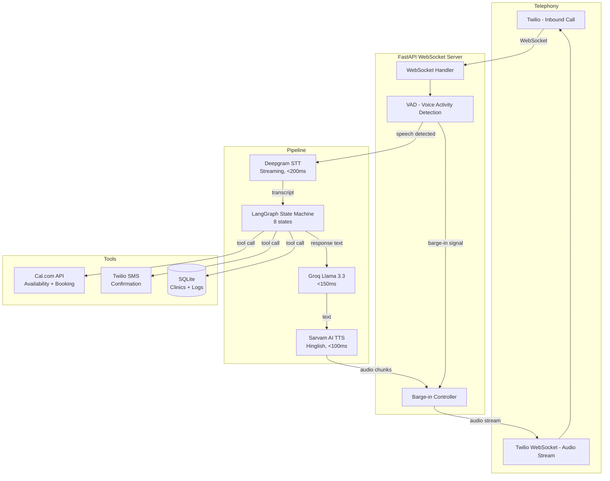
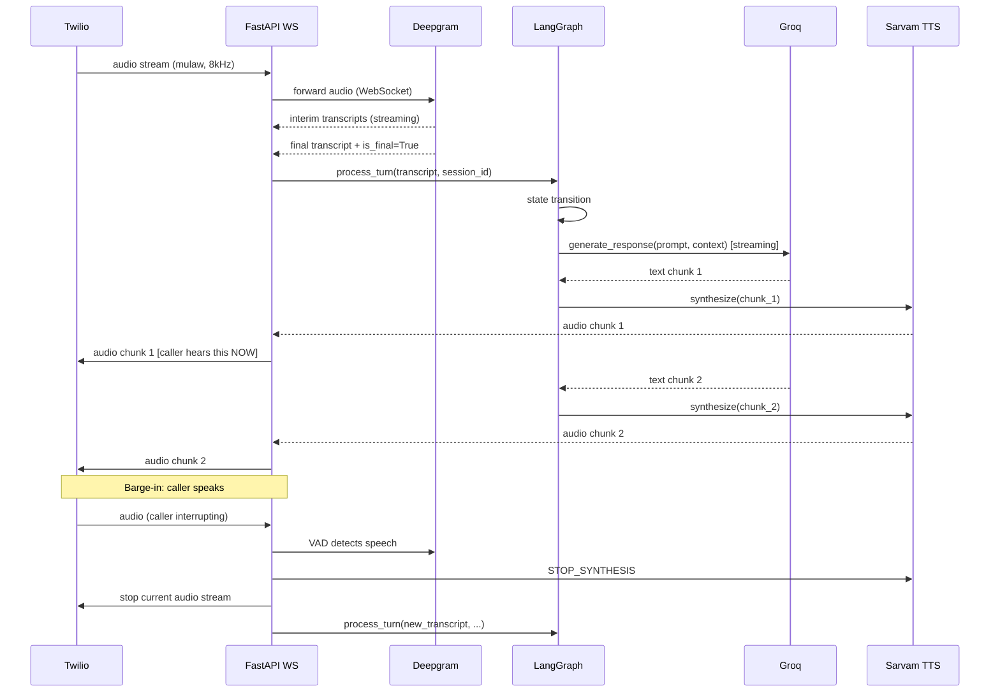

# ARCHITECTURE.md

## 1. System Overview



## 2. Latency Budget

Every turn must complete in < 800ms (p95). Here's the breakdown:

```
Event: Caller finishes speaking (VAD end-of-speech)
  │
  ├─ Deepgram final transcript arrives        +0ms  (already streaming)
  │
  ├─ LangGraph state transition               +10ms (in-memory, negligible)
  │
  ├─ Groq API call (first token)             +150ms (p50), +200ms (p95)
  │  [streaming — TTS starts on first chunk]
  │
  ├─ Sarvam TTS (first audio chunk)          +100ms (p50), +150ms (p95)
  │
  └─ First audio byte to Twilio              +360ms (p50), +490ms (p95)
                                              ───────────────────────────
                                              Total p95: ~490ms ✓
```

**Key optimization:** TTS starts processing the FIRST chunk from Groq's
streaming response — it doesn't wait for the complete response. This
overlapping-pipeline design cuts perceived latency by ~300ms vs sequential.

See `docs/LATENCY.md` for detailed benchmarks and optimization techniques.

## 3. WebSocket Flow (per turn)



## 4. Barge-in Detection

Deepgram's VAD emits `speech_started` events in real-time while streaming.
The barge-in controller:

```python
class BargeinController:
    def __init__(self):
        self.is_agent_speaking = False
        self.current_synthesis_task: asyncio.Task | None = None

    async def on_speech_started(self):
        """Called when Deepgram VAD detects caller speech."""
        if self.is_agent_speaking and self.current_synthesis_task:
            self.current_synthesis_task.cancel()
            await self.send_silence_to_twilio()  # clean audio cutoff
            self.is_agent_speaking = False

    async def speak(self, text: str, twilio_ws: WebSocket):
        self.is_agent_speaking = True
        self.current_synthesis_task = asyncio.create_task(
            self._stream_tts(text, twilio_ws)
        )
        try:
            await self.current_synthesis_task
        except asyncio.CancelledError:
            pass  # barge-in — clean exit
        finally:
            self.is_agent_speaking = False
```

## 5. Session State Management

Each call has a `CallSession` stored in memory (dict keyed by Twilio `CallSid`):

```python
@dataclass
class CallSession:
    call_sid: str
    clinic_id: str
    conversation_state: str          # current LangGraph state name
    collected_info: CollectedInfo    # name, preferred_time, doctor
    turn_count: int
    clarification_attempts: int      # max 2 before escalate
    transcript: list[Turn]           # full conversation log
    started_at: datetime
    booking_id: str | None
```

Sessions expire after 10 minutes (call timeout). On expiry, session is
serialized to SQLite `call_logs` table.

## 6. Multi-Tenant Clinic Profiles

Each clinic has a `ClinicProfile` in SQLite, loaded at call-start via
the Twilio `To` number (each clinic gets its own Twilio number):

```python
@dataclass
class ClinicProfile:
    clinic_id: str
    name: str                        # "Dr. Sharma's Clinic"
    doctor_name: str                 # "Dr. Rahul Sharma"
    specialty: str                   # "General Physician"
    phone_number: str                # Twilio number for this clinic
    language_preference: str         # "hinglish" | "english" | "hindi"
    business_hours: dict             # {"mon": "09:00-18:00", ...}
    calcom_username: str             # Cal.com account for this clinic
    emergency_number: str            # human to transfer to
    booking_lead_time_hours: int     # min notice required (e.g., 2)
    greeting_template: str           # customizable opening line
```

## 7. Emergency Detection

Before any state transition, every transcript is checked against emergency
patterns (runs in < 5ms, no LLM call):

```python
EMERGENCY_PATTERNS = [
    r"\b(emergency|urgent|bahut dard|chest pain|breathing|unconscious)\b",
    r"\b(accident|bleeding|faint|fit|seizure)\b",
    r"\b(zyada|bahut|extreme).{0,20}(pain|dard|problem)\b",
]

def check_emergency(transcript: str) -> bool:
    return any(re.search(p, transcript, re.IGNORECASE) for p in EMERGENCY_PATTERNS)
```

If triggered, state machine immediately transitions to `EMERGENCY_ESCALATE`
regardless of current state — no further LLM call, pre-recorded response only.

## 8. Key Architectural Decisions

| Decision | Rationale |
|---|---|
| Deepgram over Whisper (local) | Deepgram streams — first transcript in <200ms. Whisper processes full utterance — adds 1-3s latency. For real-time voice, streaming wins. |
| Sarvam AI over ElevenLabs | Natural Indian accent for Hinglish. ElevenLabs sounds American. For Indian clinic patients, accent authenticity matters. |
| Groq over OpenAI | <150ms first token vs ~400ms. In voice AI, 250ms difference is perceptible. |
| In-memory session state | SQLite writes happen async after turn; hot path never waits for DB. |
| LangGraph over bare if/else | Explicit state machine is testable, debuggable, auditable. Each state can have its own prompt and tool access. |
| Streaming TTS (chunk-by-chunk) | First audio byte plays before full response generated. Cuts perceived latency by ~300ms. |