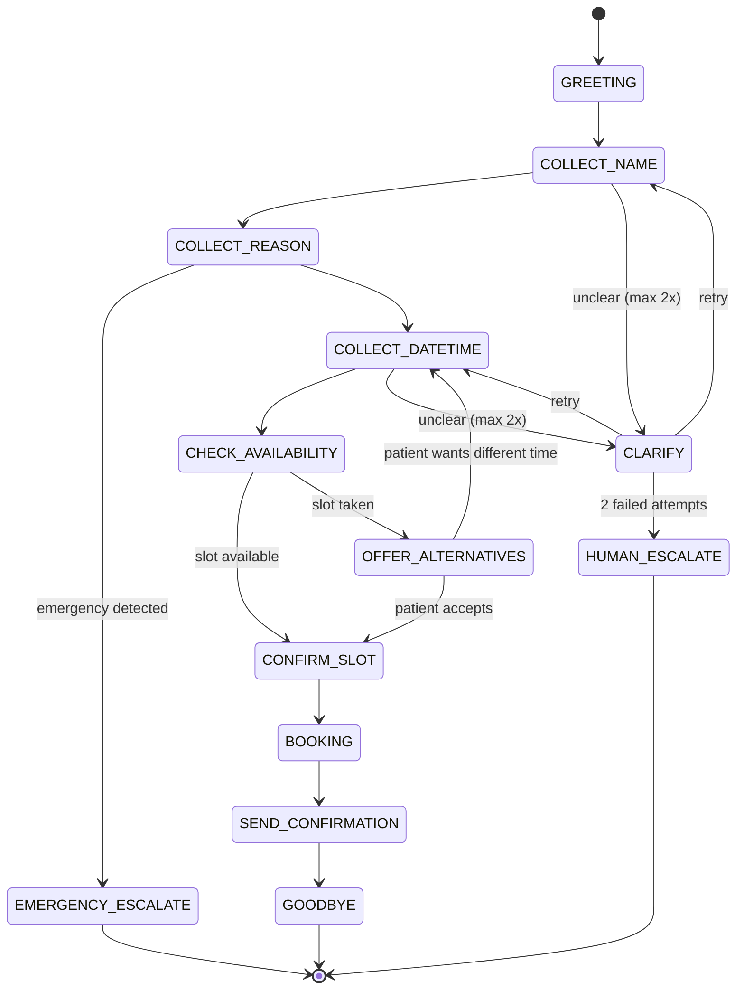

# CONVERSATION_DESIGN.md

## 1. State Machine Overview



## 2. State Definitions

### GREETING
**Trigger:** Call connected.
**Action:** Play pre-synthesized greeting (no LLM call — saves ~200ms on
first turn where latency impression matters most).

**English clinic greeting:**
> "Hello! Thank you for calling Dr. Sharma's clinic. I'm the virtual receptionist.
> How can I help you today?"

**Hinglish clinic greeting:**
> "Namaste! Dr. Sharma ki clinic mein aapka swagat hai. Main virtual receptionist
> hoon. Aaj main aapki kaise help kar sakta hoon?"

**On any input:** → COLLECT_NAME

---

### COLLECT_NAME
**Purpose:** Extract patient's name.
**Tools:** None.

**Prompt (`prompts/collect_name_v1.txt`):**
```
You are SlotBot, a friendly clinic receptionist speaking {language}.
Extract the patient's name from their message.

If name is clear: respond warmly and confirm the name, then ask for
the reason for visit.
If name is unclear: ask for clarification once, politely.

Message: {transcript}
Previous context: {context}

Respond naturally in {language}. Max 2 sentences.
Return JSON: {"extracted_name": "...", "response": "...", "confidence": 0.0-1.0}
```

**Hinglish example:**
- Caller: "Main Rahul hoon"
- Agent: "Rahul ji, aapka shukriya! Aap doctor se kisi khaas problem ke liye
  milna chahte hain ya regular checkup ke liye?"

**Edge cases:**
- Full name given: extract and use first name for natural conversation.
- Only first name: fine, proceed.
- Unclear ("haan" / "main hi hoon"): clarification attempt.
- Title given ("Mrs. Sharma"): use "Sharma ji" form.

---

### COLLECT_REASON
**Purpose:** Understand reason for visit (not for medical triage — just for
routing multi-specialty clinics and to personalize confirmation SMS).
**Also:** Emergency keyword check on this input.

**Example exchanges:**

English:
- Agent: "What brings you in today, Rahul?"
- Caller: "Just a general checkup"
- Agent: "Got it! When would you like to come in?"

Hinglish:
- Agent: "Theek hai Rahul ji! Aap kab aana chahte hain? Aur kisi khaas
  doctor se milna hai ya general checkup hai?"

Emergency branch:
- Caller: "Bahut chest pain ho raha hai"
- Agent: [IMMEDIATE] "Yeh emergency lag rahi hai. Please abhi
  Dr. Sharma ke emergency number pe call karein: 98765-XXXXX.
  Hum aapki madad karna chahte hain. Please immediately call karein."
  → END CALL

---

### COLLECT_DATETIME
**Purpose:** Extract preferred date and time from natural language.
**This is the hardest NLP problem in the pipeline — see §3.**

**Tool:** `parse_datetime(utterance, clinic_timezone, current_datetime)`

**Hinglish datetime expressions handled:**
| Utterance | Parsed |
|---|---|
| "kal subah 10 baje" | tomorrow 10:00 AM |
| "Monday ko dopahar mein" | next Monday ~12:00-14:00 |
| "parso morning" | day-after-tomorrow morning |
| "is hafte Friday" | this Friday |
| "jaldi se, aaj" | today (earliest available) |
| "evening mein kahin bhi" | today/tomorrow evening slots |
| "next week anytime" | any slot next week |

**Vague time expressions → slot ranges:**
- "subah" → 09:00-12:00
- "dopahar" → 12:00-14:00
- "sham" / "evening" → 16:00-19:00
- "morning" → 09:00-12:00

**On ambiguity:** Agent offers two options rather than asking open-ended.
- Agent: "10 baje ya 11 baje — kaunsa better hai aapke liye?"

---

### CHECK_AVAILABILITY
**Purpose:** Check Cal.com for available slots near requested time.
**Tool:** `get_available_slots(calcom_username, date, time_range, duration_minutes)`

**If slot available:**
- Agent: "10 baje ka slot available hai. Kya main book kar doon?"
- → CONFIRM_SLOT

**If slot not available:**
- Agent: "10 baje slot already booked hai. 11 baje ya 3 baje available
  hai — kaunsa prefer karenge?"
- → OFFER_ALTERNATIVES

**Critical:** Availability is re-checked at BOOKING stage too (race condition
guard — another caller may have taken the slot between CHECK and CONFIRM).

---

### CONFIRM_SLOT
**Purpose:** Verbal confirmation before booking.

**Agent:** "Toh main confirm karta hoon — Dr. Sharma ke saath {date} ko
{time} baje. Aapka naam {name} hai. Sahi hai na?"

**Caller confirms:** → BOOKING
**Caller corrects:** → COLLECT_DATETIME (with corrected info)

---

### BOOKING
**Purpose:** Create Cal.com booking. Async DB log.
**Tool:** `create_booking(calcom_username, name, phone, datetime, reason)`

**Guard:** Always calls `check_availability()` immediately before
`create_booking()`. If slot taken in the interim:
- Agent: "Oh! Abhi abhi yeh slot book ho gaya. Ek second..." → OFFER_ALTERNATIVES

**On booking success:** → SEND_CONFIRMATION

---

### SEND_CONFIRMATION
**Purpose:** Send SMS, verbally confirm, close warmly.
**Tool:** `send_sms(phone, message)`

**SMS template:**
```
Appointment confirmed ✓
Dr. {doctor_name}
{date}, {time}
{clinic_name}

Reply CANCEL to cancel.
Queries? {clinic_phone}
```

**Agent:** "Perfect! Appointment book ho gaya. Aapko SMS aa jayega confirm
details ke saath. Koi aur help chahiye?"

---

### GOODBYE
**Agent:** "Shukriya {name} ji! Get well soon. Agar koi changes chahiye toh
hume call karein. Alvida!"

→ END CALL, serialize session to SQLite.

---

### HUMAN_ESCALATE
**Trigger:** 2 failed clarification attempts, or caller explicitly asks for
human.

**Agent:** "Main samajh nahi paya. Main aapko hamare staff se connect karta
hoon. Ek moment please." → transfer to clinic phone / WhatsApp.

---

### EMERGENCY_ESCALATE
**Trigger:** Emergency pattern detected (any state).
**Response:** Pre-recorded, no LLM call, instant.
**Always transfers to emergency number.**

---

## 3. Hinglish NLP Design

### The Code-Switching Problem

Indian callers naturally mix Hindi and English mid-sentence:
- "Monday ko morning appointment chahiye"
- "Can you book me ek slot for tomorrow?"
- "Dr. ke saath 10 baje please"

Deepgram's multilingual model (Nova-2 with `language=hi` + `detect_language=true`)
handles this well. The transcripts come out in Roman script (not Devanagari)
which the LLM handles naturally.

### Intent Extraction Approach

Rather than a separate NER model, use structured Groq output with a prompt
that explicitly lists the fields to extract:

```python
EXTRACTION_PROMPT = """
Extract appointment details from this Hinglish/Hindi/English message.
Common patterns:
- "kal" = tomorrow, "parso" = day after tomorrow, "aaj" = today
- "subah" = morning (9-12), "dopahar" = afternoon (12-2), "sham/evening" = (4-7)
- "baje" follows time numbers: "10 baje" = 10 o'clock
- Numbers may be in English (10, 11) or Hindi words (das, gyarah)

Message: {transcript}

Return JSON only:
{
  "name": null or "string",
  "preferred_date": null or "YYYY-MM-DD",
  "preferred_time": null or "HH:MM",
  "time_is_flexible": true/false,
  "time_range_start": null or "HH:MM",
  "time_range_end": null or "HH:MM",
  "reason": null or "string",
  "confidence": 0.0-1.0
}
"""
```

### Number Recognition

Hindi number words must be mapped before datetime parsing:
```python
HINDI_NUMBERS = {
    "ek": 1, "do": 2, "teen": 3, "char": 4, "paanch": 5,
    "chhe": 6, "saat": 7, "aath": 8, "nau": 9, "das": 10,
    "gyarah": 11, "barah": 12
}
```

## 4. Conversation Quality Principles

1. **Max 2 sentences per turn.** Voice agents that speak long paragraphs
   lose callers. Every response must be ≤2 sentences.
2. **Confirm before acting.** Never book without verbal confirmation.
3. **Offer options, not open questions.** "10 baje ya 11 baje?" beats
   "When would you like to come?". Reduces clarification loops.
4. **Name-drop warmly.** Use caller's name once per 2-3 turns (not every
   turn — sounds robotic).
5. **Recover gracefully.** If STT transcript is garbled (confidence < 0.6),
   agent says "Sorry, thoda clearly bol sakte hain?" — never repeat the
   garbled transcript back to the caller.