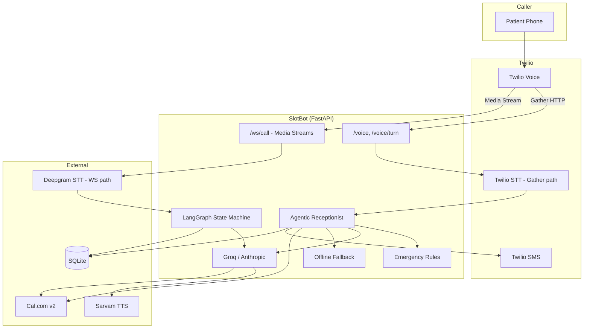

# SlotBot — Complete Technical Guide & Interview Q&A

> **Purpose:** Everything you need to explain SlotBot in interviews — architecture, trade-offs, failure modes, and Q&A from basic to advanced.
>
> **Repo:** [github.com/harshit21-shah/slotbot](https://github.com/harshit21-shah/slotbot)
>
> **Last updated:** June 2026 · **Stack:** Python 3.12 · FastAPI · Twilio · LangGraph · Groq/Anthropic · Deepgram · Sarvam · Cal.com · SQLite

---

## Table of Contents

1. [Elevator Pitch (30 seconds)](#1-elevator-pitch-30-seconds)
2. [Problem & Solution](#2-problem--solution)
3. [High-Level Architecture](#3-high-level-architecture)
4. [Two Voice Paths — Why Both Exist](#4-two-voice-paths--why-both-exist)
5. [Two Conversation Brains — LangGraph vs Agentic](#5-two-conversation-brains--langgraph-vs-agentic)
6. [End-to-End Call Flow (Step by Step)](#6-end-to-end-call-flow-step-by-step)
7. [Component Deep Dive](#7-component-deep-dive)
8. [Technology Choices — Why This, Not That](#8-technology-choices--why-this-not-that)
9. [Hinglish & Devanagari — The Hard Parts](#9-hinglish--devanagari--the-hard-parts)
10. [LLM Strategy & Fallbacks](#10-llm-strategy--fallbacks)
11. [Cal.com Booking Integration](#11-calcom-booking-integration)
12. [Latency Budget & Optimizations](#12-latency-budget--optimizations)
13. [Reliability, Failure Modes & What We Fixed](#13-reliability-failure-modes--what-we-fixed)
14. [Database & Multi-Tenancy](#14-database--multi-tenancy)
15. [Security & PII](#15-security--pii)
16. [Testing Strategy](#16-testing-strategy)
17. [Deployment & Local Dev](#17-deployment--local-dev)
18. [Known Limitations & Roadmap](#18-known-limitations--roadmap)
19. [Resume Bullet Points](#19-resume-bullet-points)
20. [Interview Q&A — Basic](#20-interview-qa--basic)
21. [Interview Q&A — Intermediate](#21-interview-qa--intermediate)
22. [Interview Q&A — Advanced / System Design](#22-interview-qa--advanced--system-design)
23. [Behavioral & "Tell Me About a Bug" Stories](#23-behavioral--tell-me-about-a-bug-stories)

---

## 1. Elevator Pitch (30 seconds)

> "I built **SlotBot** — a real-time **Hinglish voice AI receptionist** for Indian clinics. When a patient calls, the system transcribes their speech, understands mixed Hindi-English intent, checks **live calendar availability** via Cal.com, books the appointment, and sends an **SMS confirmation** — all over a normal phone call via Twilio. Under the hood it's **FastAPI + LangGraph** for conversation state, **Groq/Anthropic** for generation, **Deepgram** for streaming STT, and **Sarvam** for Indian-accent TTS. I designed it with two telephony modes: a reliable **HTTP Gather** path for dev/demo and a **WebSocket Media Streams** path for sub-second latency and barge-in."

---

## 2. Problem & Solution

### The business problem

| Pain | Impact |
|---|---|
| Clinics miss calls during consultations | Lost patients (₹500–2000 per visit) |
| Human receptionists cost ₹8K–15K/month | Only 9–5 coverage |
| Generic voice AI (Siri, Alexa) | Poor Hinglish code-switching |
| Booking over phone is unstructured | Name, reason, date, time scattered across turns |

### What SlotBot does

1. **Answers every call** (24/7 potential)
2. **Speaks natural Hinglish** — "Kal subah 10 baje appointment chahiye"
3. **Checks real availability** — Cal.com v2 API, not fake slots
4. **Books + confirms** — verbal confirmation + SMS
5. **Handles emergencies** — rule-based detection, no LLM delay
6. **Logs calls** — transcript + outcome in SQLite for audit

### What it deliberately does NOT do (V1 non-goals)

- Medical advice or symptom triage
- Video calls
- Multi-doctor routing (V2)
- WhatsApp escalation (V2)
- HIPAA certification (design is HIPAA-*adjacent*, not compliant out of box)

**Interview line:** *"I scoped V1 to appointment booking only — triage is a liability and regulatory problem. The agent collects reason for routing/SMS, not diagnosis."*

---

## 3. High-Level Architecture



### Layer responsibilities

| Layer | Responsibility | Key files |
|---|---|---|
| **Telephony** | Twilio webhooks, TwiML, sessions | `services/telephony/gather_voice.py`, `websocket.py` |
| **API** | HTTP routes, health | `services/api/routes/twilio.py`, `app.py` |
| **Agent** | Conversation logic | `services/agents/agentic_receptionist.py`, `graph.py` |
| **LLM** | Provider routing, JSON parsing | `services/agents/llm_client.py` |
| **Calendar** | Slots + booking | `services/calendar/client.py` |
| **TTS/STT** | Voice I/O | `services/tts/sarvam_client.py`, `services/stt/deepgram_client.py` |
| **Data** | Clinic profiles, call logs | `services/db/` |

---

## 4. Two Voice Paths — Why Both Exist

SlotBot supports **two fundamentally different** telephony architectures. This is one of the most important things to explain in interviews.

### Path A: HTTP Gather + Speech (production dev / demo today)

**Routes:** `POST /voice` → `POST /voice/turn`

**How it works:**
1. Twilio calls your webhook when the call connects
2. You return **TwiML** (XML) with `<Gather input="speech">` + `<Say>` or `<Play>`
3. Caller speaks → Twilio transcribes **on Twilio's side** → POSTs `SpeechResult` to `/voice/turn`
4. Your server runs one agent turn → returns new TwiML → repeat

**Why we use it:**
| Pro | Con |
|---|---|
| Works with **Cloudflare quick tunnels** (HTTPS only) | **Turn-based** — no true barge-in |
| Simple to debug — each turn is one HTTP request | Twilio **15s webhook timeout** per turn |
| No WebSocket infra needed | Twilio STT returns **Devanagari** for Hindi |
| Reliable for demos and MVP | Higher perceived latency (speak → pause → listen) |

**Key file:** `services/telephony/gather_voice.py`

**TTS options on this path:**
- `USE_SARVAM_PLAY=false` → Twilio Polly `<Say voice="Polly.Aditi">` — fast, robotic
- `USE_SARVAM_PLAY=true` → Sarvam WAV via `/voice/audio/{id}` + `<Play>` — better accent, +latency

---

### Path B: WebSocket Media Streams (low-latency / barge-in)

**Routes:** `POST /voice/stream` → `WS /ws/call`

**How it works:**
1. Twilio opens a **bidirectional WebSocket** with raw audio (μ-law 8kHz)
2. Audio forwarded to **Deepgram streaming STT** in real time
3. Final transcript → LangGraph or agent → Groq → Sarvam → audio chunks back to Twilio
4. **Barge-in:** Deepgram VAD detects caller speech → cancel TTS mid-stream

**Why we built it:**
| Pro | Con |
|---|---|
| **~490ms p95** target per turn (streaming pipeline) | Requires **stable WSS tunnel** (ngrok, not Cloudflare quick tunnel) |
| True **barge-in** — human-like overlap | More complex — async tasks, cancellation |
| **Deepgram** handles code-switching well | Harder to debug live |
| Streaming TTS starts before full LLM response | Render free tier + WebSocket timeouts need tuning |

**Key files:** `services/telephony/websocket.py`, `services/stt/deepgram_client.py`, `services/agents/barge_in.py`

**Interview line:** *"I kept Gather for reliability during development and Media Streams for the latency-sensitive production path. Cloudflare quick tunnels don't support WebSocket reliably, so local dev uses Gather + Cloudflare; production WebSockets need ngrok or a proper deploy."*

---

### Why not only WebSockets?

Because **you can't demo** if the tunnel breaks every 30 minutes. Gather works over plain HTTPS POST — Twilio always reaches you if the tunnel URL is valid.

### Why not only Gather?

Because **real receptionists interrupt and overlap**. Gather is speak-then-listen. For a portfolio/production clinic product, WebSocket path shows you understand real-time systems.

---

## 5. Two Conversation Brains — LangGraph vs Agentic

SlotBot has **two conversation implementations**. Know both — interviews will ask why.

### LangGraph state machine (structured, testable)

**File:** `services/agents/graph.py` + `services/agents/states/*`

**States:** greeting → collect_name → collect_reason → collect_datetime → check_availability → confirm_slot → booking → send_confirmation → goodbye

**Branch states:** clarify, offer_alternatives, emergency_escalate, human_escalate

**Why LangGraph:**
| Benefit | Explanation |
|---|---|
| **Explicit FSM** | Each state = one file, one prompt, one job |
| **Testable routing** | `tests/unit/test_routing.py` tests every transition |
| **Auditable** | You know exactly why booking happened |
| **Tool gating** | Calendar tools only in check/booking states |
| **No runaway LLM** | LLM extracts info; graph decides next step |

**Why NOT bare if/else:**
- 12 states × edge cases = spaghetti
- LangGraph gives checkpointing, visualization, and clean routing functions

**Used by:** WebSocket path, `scripts/simulate_call.py`

---

### Agentic receptionist (natural, flexible)

**File:** `services/agents/agentic_receptionist.py`

**How it works:**
1. Multi-turn **message history** in session (last 14 turns)
2. Single system prompt with **tool definitions** in JSON
3. LLM returns `{ response, tool_calls, end_call }`
4. Tools executed: `get_slots`, `book`, `end_call`
5. Up to 2 tool rounds per user utterance

**Why agentic:**
| Benefit | Explanation |
|---|---|
| **Natural conversation** | Patient says name + date + problem in one sentence — handled |
| **Fewer rigid steps** | No forced "first name, then reason, then date" |
| **Real receptionist feel** | Autonomous decisions within tool constraints |

**Trade-offs:**
| Risk | Mitigation |
|---|---|
| LLM skips confirmation | Prompt: "confirm before book" + tool only on explicit yes |
| Double booking | `check_slot_available()` before every `create_booking()` |
| Webhook timeout (15s) | Max 2 tool rounds, 14s LLM timeout |
| Groq rate limit | Anthropic primary + offline fallback |

**Used by:** Gather path (`gather_voice.py` → `run_agent_turn()`)

---

### Why both coexist?

**Evolution story for interviews:**

> "I started with LangGraph because explicit state machines are easier to test and debug — critical for booking correctness. Once the pipeline worked, I added an agentic layer for the Gather path because real callers don't follow a form. LangGraph remains for simulation, routing tests, and the WebSocket path; the agentic brain handles live phone demos where natural conversation matters more."

---

## 6. End-to-End Call Flow (Step by Step)

### Gather path (what you demoed on real calls)

```
1. OUTBOUND/INBOUND call hits Twilio
2. Twilio POST /voice
   → load clinic from SQLite by phone number
   → return TwiML: <Gather> + greeting (Say or Sarvam Play)
3. Patient speaks: "Mujhe appointment chahiye"
4. Twilio POST /voice/turn  SpeechResult="मुझे अपॉइंटमेंट चाहिए"
5. gather_voice.py:
   a. Emergency check (regex, <5ms)
   b. Load/create GatherSession (in-memory, keyed by CallSid)
   c. run_agent_turn(ctx, utterance)
      → LLM (Anthropic) returns response + maybe tool_calls
      → get_slots / book via Cal.com if needed
   d. Return TwiML: agent speech + new <Gather>
6. Repeat until booking or end_call
7. Persist CallLog to SQLite (transcript, outcome, duration)
8. Optional: SMS confirmation async via Twilio
```

### WebSocket path (low-latency)

```
1. Twilio POST /voice/stream → TwiML <Connect><Stream url="wss://.../ws/call">
2. websocket.py accepts connection, reads Twilio media events
3. Audio frames → DeepgramSTT (streaming)
4. On final transcript → LangGraph graph.ainvoke(state)
5. Response text → Sarvam TTS → μ-law chunks → Twilio
6. If VAD speech_started during TTS → BargeinController cancels synthesis
7. On call end → persist session
```

---

## 7. Component Deep Dive

### `services/telephony/gather_voice.py`

- **GatherSession:** in-memory call state (messages, booking_id, language)
- **Session TTL:** 600 seconds
- **STT hints:** Roman Hinglish keywords to bias Twilio STT
- **`language="hi-IN"`** on Gather → Hindi model (outputs Devanagari)
- **Emergency:** `is_emergency()` before any LLM call
- **Fallback:** `offline_fallback.py` if LLM throws

### `services/agents/agentic_receptionist.py`

- **AgentContext:** call_sid, clinic, patient_phone, messages[], booking_id
- **Tools:** get_slots, book, end_call (max 3 tool calls per batch)
- **Booking guard:** availability re-checked at book time
- **SMS:** fire-and-forget `asyncio.create_task(send_confirmation_sms(...))`

### `services/agents/llm_client.py`

- **Providers:** Anthropic (primary) → Groq (fallback), configurable via `LLM_PRIMARY`
- **Output:** JSON mode — all agent responses parsed as JSON
- **`_parse_json_content`:** handles LLM wrapping JSON in markdown/text

### `services/agents/offline_fallback.py`

- Rule-based replies when LLM unavailable
- Patterns: "sun pa rahe ho?", greetings, name extraction, appointment intent
- **Why:** Better to say "Haan ji, bilkul sun rahi hoon!" than "technical problem"

### `services/agents/hinglish_parser.py`

- Rule-based datetime/name parsing for Roman Hinglish
- Hindi number words: das, gyarah, etc.
- **Limitation:** doesn't handle Devanagari — LLM handles that

### `services/calendar/client.py`

- **Cal.com v2** (v1 API returns 410 Gone)
- Endpoints: `GET /v2/slots`, `POST /v2/bookings`
- Version headers: `cal-api-version: 2024-09-04` (slots), `2024-08-13` (bookings)
- Timezone: Asia/Kolkata

### `services/agents/emergency.py`

- Regex patterns: chest pain, breathing, unconscious, bahut dard, etc.
- **No LLM** — instant pre-written response + emergency number
- **Why regex:** LLM adds 1–3s delay in emergencies; regex is <5ms

### `services/db/database.py`

- **SQLite** via aiosqlite
- Tables: `clinic_profiles`, `call_logs`
- Async init on FastAPI startup

---

## 8. Technology Choices — Why This, Not That

### Telephony: Twilio

| Why Twilio | Alternatives considered |
|---|---|
| Best docs, Media Streams, SMS in one platform | Vonage, Plivo — viable but less ecosystem |
| Trial account for demos | Self-hosted SIP — too much infra for MVP |
| Gather for simple HTTPS dev | |

**Not Telnyx/etc.:** Twilio's Gather + Speech is fastest path to working demo.

---

### STT: Deepgram (WS path) vs Twilio STT (Gather path)

| | Deepgram | Twilio Gather STT |
|---|---|---|
| Latency | Streaming, ~200ms | End-of-utterance batch |
| Code-switch | Nova-2 multilingual | hi-IN, returns Devanagari |
| Cost | Separate API key | Bundled in Twilio |
| When used | WebSocket path | Gather path |

**Not Whisper local:** Batch processing adds 1–3s — unacceptable for voice.

**Not Google STT:** Deepgram's streaming API is simpler for WebSocket pipeline.

---

### LLM: Groq + Anthropic (not OpenAI-only)

| | Groq Llama 3.3 | Anthropic Haiku |
|---|---|---|
| Speed | ~150ms first token | ~300ms |
| Cost | Free tier, rate limits | Paid, reliable |
| JSON mode | Yes | Yes |
| When | Fallback / dev | **Primary** (after rate limit pain) |

**Why not GPT-4o for everything:** Latency + cost for a receptionist that speaks 1–2 sentences.

**Why not local Llama:** GPU infra, slower cold start, harder deploy on Render free tier.

---

### TTS: Sarvam (not ElevenLabs)

| Sarvam | ElevenLabs |
|---|---|
| Natural **Indian** accent | American/British default |
| bulbul:v3, speaker priya | Great quality but wrong persona |
| Hindi/Hinglish native | |

**Fallback:** Twilio Polly Aditi when Sarvam slow or tunnel issues.

---

### Orchestration: LangGraph (not raw chains)

| LangGraph | LangChain Agent only |
|---|---|
| Explicit states + routing | Black box tool loops |
| Unit-testable transitions | Hard to audit booking flow |
| Checkpointing built-in | |

**Not Temporal/Inngest:** Overkill for single-call state; in-memory session sufficient for V1.

---

### Database: SQLite (not Postgres)

| SQLite | Postgres |
|---|---|
| Zero config, file on disk | Needs managed service |
| Fine for single-clinic V1 | Needed for multi-tenant V2 scale |
| Async via aiosqlite | |

**Migration path:** SQL schema is simple; swap connection string for V2.

---

### Framework: FastAPI (not Flask/Django)

- Native **async** for WebSocket + httpx
- Auto OpenAPI docs in dev
- Pydantic settings for `.env.local`

---

## 9. Hinglish & Devanagari — The Hard Parts

### Code-switching examples

```
"Kal subah 10 baje appointment chahiye"
"Can you book me ek slot for tomorrow?"
"Dr. Sharma ke saath milna hai"
```

### The Devanagari surprise

Twilio Gather with `language="hi-IN"` returns:
```
"मुझे अपॉइंटमेंट चाहिए"
"क्या आप मुझे सुन पा रहे हो?"
```

**Not Roman Hinglish** as Design.md originally assumed.

### How we handle it

| Layer | Approach |
|---|---|
| **Agent prompt** | "Understand Devanagari input; reply in Roman Hinglish" |
| **Offline fallback** | Regex for Devanagari hear-me / greeting patterns |
| **hinglish_parser** | Roman only — used as supplement, not primary |
| **LLM** | Anthropic/Groq handle Devanagari well |

**Interview story:** *"Twilio's Hindi STT outputs Devanagari, but our early rule parser expected Roman. Fix: LLM-first understanding + offline patterns for common Devanagari phrases + prompt update. Lesson: always inspect raw STT output in target locale."*

---

## 10. LLM Strategy & Fallbacks

### Provider order (`LLM_PRIMARY=anthropic`)

```
1. Anthropic Haiku  →  primary (reliable, handles Devanagari)
2. Groq Llama 3.3   →  fallback (fast when quota available)
3. offline_fallback   →  rule-based Hinglish (no API)
4. Generic friendly message  →  last resort
```

### JSON contract (agentic)

```json
{
  "response": "Achha ji, kal 10 baje check karti hoon.",
  "tool_calls": [
    {"tool": "get_slots", "date": "2026-06-17"}
  ],
  "end_call": false
}
```

### Prompt rules (business logic in prompt)

- Max 2 sentences per turn
- First name only — never ask last name/email
- Confirm before booking
- No medical advice
- Call `book()` when patient says haan/yes/book karo

### Why JSON output?

Structured tool calls without OpenAI function-calling vendor lock-in. Same pattern works on Groq and Anthropic.

---

## 11. Cal.com Booking Integration

### Flow

```
get_slots(date)  →  GET /v2/slots?eventTypeId=&start=&end=
check_slot_available(date, time)  →  verifies specific slot in list
create_booking(...)  →  POST /v2/bookings
```

### Double-booking guard

**Problem:** Slot free at turn 3, taken by another caller at turn 5.

**Solution:** Always `check_slot_available()` immediately before `create_booking()`. If taken → offer alternatives.

**Interview line:** *"Double-booking is worse than failing to book — we re-check availability at commit time, not just at inquiry time."*

### v1 → v2 migration

Cal.com v1 API returned **410 Gone**. Migrated to v2 with versioned headers. Real bug from production testing.

---

## 12. Latency Budget & Optimizations

### Target (WebSocket path)

| Stage | p50 | p95 |
|---|---|---|
| STT final transcript | 0ms (streaming) | 0ms |
| LangGraph transition | 10ms | 10ms |
| LLM first token | 150ms | 200ms |
| TTS first chunk | 100ms | 150ms |
| **Total to first audio** | **~380ms** | **~490ms** |

### Key optimization: streaming overlap

Don't wait for full LLM response before TTS. Pipe first sentence to Sarvam while LLM still generating.

### Gather path latency (honest numbers)

| Stage | Typical |
|---|---|
| Twilio STT end-of-speech | 1–3s |
| LLM round trip | 1–3s |
| TTS (Polly or Sarvam Play) | 0.5–2s |
| **Per turn** | **3–8s** |

**Interview honesty:** *"Gather path is turn-based; sub-second latency requires Media Streams. I quote different numbers for each path."*

---

## 13. Reliability, Failure Modes & What We Fixed

### Failure mode catalog

| Failure | Symptom | Root cause | Fix |
|---|---|---|---|
| Application error on call | Twilio 11200 | Dead Cloudflare tunnel URL | `check_tunnel.py`, restart tunnel, update `APP_BASE_URL` |
| Agent says "technical problem" | Both LLMs fail | Groq 429 + wrong Anthropic model | `LLM_PRIMARY=anthropic`, fix model ID |
| Stale agent behavior | Old step names in logs | Uvicorn not restarted after code change | Restart server after deploy |
| Devanagari not understood | Robotic re-asks | Rule parser Roman-only | Agentic LLM + offline Devanagari patterns |
| WebSocket fails locally | No audio | Cloudflare quick tunnel + WSS | Use Gather path or ngrok |
| Twilio 15s timeout | Call drops mid-turn | 2+ LLM rounds + slow APIs | Cap tool rounds, 14s LLM timeout |
| Cal.com booking fails | Empty slots | v1 API deprecated | Migrate to v2 |
| Secret leaked to GitHub | Push blocked | Real Twilio SID in test file | Placeholder in tests |

### Resilience patterns used

1. **Multi-provider LLM** with configurable primary
2. **Offline fallback** — human Hinglish without API
3. **Emergency regex** — no LLM dependency
4. **TTS fallback** — Sarvam → Polly
5. **Session TTL + prune** — no memory leak on abandoned calls
6. **Try/except per turn** — call continues even if one turn fails

---

## 14. Database & Multi-Tenancy

### Schema

**clinic_profiles** — one row per clinic (Twilio number is lookup key)

**call_logs** — one row per call (transcript JSON, outcome, booking_id)

### Multi-tenant design (V1)

- Lookup clinic by `To` number on inbound
- Outbound: clinic phone from Twilio `From`
- Each clinic has own `calcom_username` + `event_type_id`

### Session vs DB

| Data | Where | Why |
|---|---|---|
| Active conversation | In-memory dict | Hot path speed |
| Clinic config | SQLite | Loaded once per call |
| Call history | SQLite | Written at call end |

---

## 15. Security & PII

### What's stored

- Caller phone (E.164)
- Name (first name only)
- Transcript (user + agent turns)
- Booking ID

### What's NOT stored

- Raw audio (by default)
- Medical records
- Payment info

### Secrets management

- `.env.local` gitignored
- GitHub push protection caught Twilio SID in tests
- Render env vars via `sync: false`

### HIPAA note

Design avoids diagnosis but **is not HIPAA compliant**. Would need BAA with Twilio, encryption at rest, access controls, audit logging for production healthcare.

**Interview answer:** *"V1 is a portfolio/MVP. For production healthcare I'd add encryption, RBAC, audit trails, and BAAs with all vendors processing PHI."*

---

## 16. Testing Strategy

### Unit tests (74 tests, CI on GitHub Actions)

| Test file | What it covers |
|---|---|
| `test_routing.py` | LangGraph state transitions |
| `test_emergency_detection.py` | Emergency regex |
| `test_hinglish_parser.py` | Datetime/name parsing |
| `test_llm_client.py` | JSON parse, provider fallback |
| `test_calendar_client.py` | Cal.com client mocking |
| `test_offline_fallback.py` | Devanagari offline replies |
| `test_phone.py` | E.164 normalization |

### Simulation scripts

```bash
python scripts/simulate_call.py      # LangGraph path, no phone
python scripts/simulate_agent.py     # Agentic path scenarios
python scripts/health_check.py       # Live API smoke test (needs keys)
python scripts/outbound_call.py      # Real Twilio call
```

### What's NOT fully automated

- End-to-end live call eval (50-call 91% target is design goal)
- Latency p95 benchmarks in CI
- WebSocket barge-in integration tests

---

## 17. Deployment & Local Dev

### Local dev stack

```bash
# Terminal 1
python -m uvicorn services.api.app:app --host 127.0.0.1 --port 8888

# Terminal 2
npx cloudflared tunnel --url http://127.0.0.1:8888
# Copy URL → APP_BASE_URL in .env.local → restart server

python scripts/seed_clinic.py --phone +1YOUR_TWILIO_NUMBER
python scripts/outbound_call.py 91XXXXXXXXXX --base-url https://YOUR-TUNNEL
```

### Or use `scripts/start_dev.py`

Starts server + tunnel + syncs `.env.local` automatically.

### Render (`render.yaml`)

- Free tier web service
- `uvicorn` on `$PORT`
- SQLite on ephemeral disk (resets on deploy — OK for demo, not prod)

### Twilio trial limitations

- Outbound only to **verified** numbers
- Trial message before call

---

## 18. Known Limitations & Roadmap

### Current limitations (be honest in interviews)

1. Gather path is not truly conversational (no barge-in)
2. WebSocket path needs ngrok/production WSS
3. Eval metrics in README are **design targets**, not published benchmark results
4. Single clinic seeded by default
5. Groq free tier rate limits
6. Polly fallback sounds robotic
7. No human handoff transfer implemented (escalate message only)
8. SQLite on Render is not durable

### V2 roadmap (from PRD)

- Multi-doctor routing
- Multi-tenant clinic admin
- Reschedule/cancel flows
- WhatsApp fallback
- Streaming TTS chunk optimization

---

## 19. Resume Bullet Points

Use 3–4 of these:

- Built **SlotBot**, a real-time Hinglish voice AI receptionist for Indian clinics using **Twilio, FastAPI, LangGraph, and Cal.com**, handling live appointment booking over phone with SMS confirmation
- Designed **dual telephony architecture**: HTTP Gather webhooks for reliable dev/demo and **WebSocket Media Streams** with Deepgram/Sarvam for sub-500ms latency targets and barge-in
- Implemented **agentic tool-calling** receptionist (get_slots, book, end_call) with **multi-provider LLM routing** (Anthropic/Groq) and rule-based offline fallback for API failures
- Integrated **Cal.com v2 API** with double-booking guards; migrated from deprecated v1 after production 410 errors
- Added **74 unit tests** + GitHub Actions CI; handled **Devanagari STT** from Twilio Hindi model with LLM-first understanding

**GitHub:** https://github.com/harshit21-shah/slotbot

---

## 20. Interview Q&A — Basic

### Q: What is SlotBot in one sentence?

**A:** A voice AI phone receptionist for Indian clinics that speaks Hinglish, checks live calendar availability, books appointments, and sends SMS confirmations via Twilio.

---

### Q: What technologies did you use?

**A:** Python 3.12, FastAPI, Twilio (Voice + SMS), LangGraph, Groq and Anthropic LLMs, Deepgram STT, Sarvam TTS, Cal.com API, SQLite, deployed on Render with GitHub Actions CI.

---

### Q: How does a caller interact with it?

**A:** They call a Twilio number. The AI greets them in Hinglish, asks for name/reason/time, checks Cal.com for slots, confirms verbally, books, and sends an SMS. All over a normal phone call — no app needed.

---

### Q: What is Hinglish?

**A:** Hindi-English code-switching common in urban India — mixing Hindi grammar with English nouns, e.g. "kal morning appointment chahiye Doctor ke saath."

---

### Q: Why clinics? Why not a generic chatbot?

**A:** Clinics lose revenue on missed calls; phone is still the primary booking channel in India. Voice + phone meets users where they are — no smartphone app required.

---

### Q: What is TwiML?

**A:** Twilio Markup Language — XML instructions Twilio executes: `<Say>`, `<Gather>`, `<Play>`, `<Connect><Stream>`. Our server returns TwiML, Twilio runs the call.

---

### Q: What is LangGraph?

**A:** A library for building stateful agent workflows as graphs — nodes (states), edges (routing), checkpointing. I use it for explicit booking conversation states.

---

### Q: What's the difference between STT and TTS?

**A:** STT (Speech-to-Text) = caller audio → text. TTS (Text-to-Speech) = agent text → audio. Deepgram/Sarvam for quality path; Twilio built-in for Gather path.

---

### Q: How do you store data?

**A:** SQLite — clinic profiles (doctor, Cal.com credentials, greeting) and call logs (transcript, outcome, booking ID). Active call sessions live in memory.

---

### Q: Is it deployed?

**A:** Render config exists (`render.yaml`); local dev uses Cloudflare tunnel + Twilio. Live demo requires API keys and tunnel/ deploy URL configured in Twilio.

---

## 21. Interview Q&A — Intermediate

### Q: Explain your architecture in 2 minutes.

**A:** Twilio receives the call and hits our FastAPI server. We have two paths: (1) Gather — Twilio transcribes speech and POSTs text each turn; our agentic receptionist calls the LLM and Cal.com, returns TwiML to speak back. (2) Media Streams — raw audio over WebSocket to Deepgram STT, LangGraph state machine, Groq/Anthropic LLM, Sarvam TTS streaming back. Calendar booking goes through Cal.com v2 with availability re-check before commit. Sessions are in-memory during the call, persisted to SQLite after.

---

### Q: Why two voice paths?

**A:** Gather works over HTTPS only — reliable with Cloudflare tunnels for development. WebSockets need stable WSS (ngrok/production) but enable streaming STT, streaming TTS, and barge-in for low latency. I didn't want to block demos on WebSocket infra while still proving I can build the real-time path.

---

### Q: Why LangGraph AND an agentic receptionist?

**A:** LangGraph gives testable, auditable booking flows — important for correctness. The agentic layer handles natural speech where users give name, date, and reason in one utterance. LangGraph for structure and tests; agentic for live phone UX.

---

### Q: How do you prevent double booking?

**A:** `check_slot_available()` runs immediately before `create_booking()`, not just when first discussing the slot. If taken, agent offers alternatives from fresh `get_slots()` results.

---

### Q: How do you handle LLM failures?

**A:** Three layers: (1) Primary Anthropic, fallback Groq — configurable order. (2) Rule-based offline fallback for common phrases in Hinglish/Devanagari. (3) Friendly generic message if all else fails. Never expose stack traces to the caller.

---

### Q: How do you handle emergencies?

**A:** Regex on every utterance before LLM — chest pain, breathing trouble, unconscious, etc. Instant scripted response with emergency number. No LLM delay. Transitions to emergency_escalate state.

---

### Q: What was the hardest bug you fixed?

**A:** Live calls failing with "application error" — traced to expired Cloudflare tunnel URLs (Twilio 11200). Separately, Groq rate limits plus wrong Anthropic model ID meant both LLMs failed simultaneously. Fixed with tunnel validation script, Anthropic as primary, and server restart discipline.

---

### Q: Why Deepgram over Whisper?

**A:** Deepgram streams transcripts in real time — first tokens arrive while the user is still speaking. Whisper processes full utterances — adds seconds of latency unsuitable for conversational voice.

---

### Q: Why Sarvam over ElevenLabs?

**A:** Indian patients expect an Indian accent. Sarvam's bulbul model with Priya speaker sounds natural for Hinglish. ElevenLabs defaults sound American.

---

### Q: Why SQLite not PostgreSQL?

**A:** V1 single-clinic MVP — zero ops overhead, async aiosqlite works fine. Schema is migration-ready for Postgres when multi-tenant scale requires it.

---

### Q: How does session management work?

**A:** `GatherSession` dict keyed by Twilio `CallSid` — messages, booking_id, language. TTL 600s with prune. On call end, serialized to `call_logs` table and session deleted.

---

### Q: What's in the agent prompt?

**A:** Persona (Priya, clinic receptionist), language rules (understand Devanagari, reply Roman Hinglish), tool definitions (get_slots, book, end_call), business rules (max 2 sentences, confirm before book, no medical advice), JSON output schema.

---

### Q: How do you test without phone calls?

**A:** `simulate_call.py` replays utterances through LangGraph. `simulate_agent.py` tests agentic scenarios. 74 unit tests cover routing, parsing, emergency, LLM fallback, calendar client. CI runs unit tests on every push.

---

## 22. Interview Q&A — Advanced / System Design

### Q: Design a voice AI receptionist from scratch. What do you build first?

**A:**
1. **Happy path on paper** — greeting → collect info → check calendar → confirm → book → SMS
2. **Telephony** — Twilio Gather first (fastest proof), WebSockets later
3. **State machine** — explicit states before agentic freedom
4. **Calendar integration** — real availability early
5. **Latency** — measure each segment; optimize hot path
6. **Failure modes** — LLM down, STT garbage, timeout, double book
7. **Eval** — scripted transcripts before live calls

---

### Q: How would you scale to 10,000 clinics?

**A:**
- **Multi-tenant DB** — Postgres, clinic_id on all rows
- **Session store** — Redis keyed by CallSid (not in-memory)
- **Horizontal FastAPI** — sticky sessions or stateless turns with Redis
- **Per-clinic Twilio numbers** — already in design
- **Rate limiting** — per-clinic LLM/API quotas
- **Queue booking writes** — idempotent booking requests
- **Observability** — call latency dashboards, alert on booking failure rate
- **Separate WebSocket workers** from HTTP webhook workers

---

### Q: How do you achieve sub-800ms latency?

**A:**
- Streaming STT (don't wait for silence processing offline)
- Streaming LLM (first token triggers TTS)
- Chunked TTS (first sentence plays while rest generates)
- No blocking DB on hot path
- Pre-synthesized greeting (no LLM on first byte)
- In-memory session state
- Measure p50/p95 per segment with `latency_bench.py`

---

### Q: How does barge-in work technically?

**A:** `BargeinController` tracks `is_agent_speaking` and `current_synthesis_task`. Deepgram VAD fires `speech_started` while agent audio is playing → cancel asyncio TTS task → send silence frame to Twilio for clean cutoff → process new transcript. Caller experience: interrupting works like human conversation.

---

### Q: Trade-offs: agentic LLM vs finite state machine?

| FSM (LangGraph) | Agentic |
|---|---|
| Predictable, auditable | Flexible, natural |
| Easier to test | Can skip steps |
| Rigid turn order | Handles messy input |
| Safer for regulated booking | Needs strong prompts + guards |

**Best production approach:** FSM for booking commit + agentic for information gathering, OR agentic with mandatory confirmation tool step.

---

### Q: How would you add observability?

**A:** Structured logs per turn (call_sid, latency_ms, provider, tools called). Metrics: booking success rate, LLM failure rate, p95 turn latency, STT confidence. Trace IDs across Twilio webhook → LLM → Cal.com. Alert if booking failure > 5%. Store transcripts for QA sampling (with consent).

---

### Q: Security concerns with voice AI in healthcare?

**A:** PHI in transcripts (name, phone, reason for visit). Mitigations: encrypt at rest, retention limits, access controls, no training on patient data, vendor BAAs, audit logs. Emergency detection must not false-negative. Never give medical advice — liability.

---

### Q: Why FastAPI async for WebSockets?

**A:** Single process handles many concurrent calls — while one call awaits LLM HTTP, another processes audio. Thread-per-call doesn't scale. asyncio + httpx AsyncClient + aiosqlite fits the I/O-bound pipeline.

---

### Q: Idempotency for bookings?

**A:** Current V1 relies on Cal.com + re-check before book. V2 would add idempotency key per call_sid + slot to prevent duplicate POST on webhook retry.

---

### Q: Twilio webhook timeout — how do you handle it?

**A:** Gather has ~15s limit. Cap LLM to 14s timeout, max 2 tool rounds, async SMS after response starts. If timeout risk, return partial TwiML with "Ek second" and continue next turn. Long-term: WebSocket path removes per-turn HTTP timeout.

---

### Q: Compare Gather vs Media Streams for production.

**A:** Production at scale → Media Streams for UX. Gather acceptable for low-volume clinic if latency tolerance is higher. Hybrid: Gather fallback if WebSocket fails.

---

## 23. Behavioral & "Tell Me About a Bug" Stories

### Story 1: "Application Error" on every call

**Situation:** User heard Twilio "application error" on every test call.

**Action:** Checked Twilio debugger → HTTP 502 to webhook URL. Cloudflare quick tunnel URL had expired. Built `check_tunnel.py`, documented restart flow, synced `APP_BASE_URL`.

**Result:** Calls connected reliably after tunnel + server restart.

**Lesson:** Voice AI demos fail on infra before AI. Always validate public URL before blaming the model.

---

### Story 2: Both LLMs failed simultaneously

**Situation:** Agent said "technical problem" despite having two providers.

**Action:** Logs showed Groq 429 (daily token limit) and Anthropic 404 (deprecated model string in running server). Fixed model in `.env.local`, set Anthropic primary, added offline fallback, restarted uvicorn.

**Result:** Anthropic responded in ~1–3s; Devanagari input handled.

**Lesson:** Fallback isn't fallback if config is wrong. Restart server after env changes. Rate limits are real — design third-layer fallback.

---

### Story 3: Devanagari STT mismatch

**Situation:** User spoke Hindi; rule parser expected Roman; agent seemed dumb.

**Action:** Inspected raw `SpeechResult` — Devanagari from Twilio hi-IN. Updated agent prompt, added Devanagari patterns to offline fallback.

**Result:** "Kya aap sun pa rahe ho?" handled correctly.

**Lesson:** Test with real telephony STT output, not typed Roman text.

---

### Story 4: Cal.com v1 deprecated

**Situation:** Booking always failed silently.

**Action:** API returned 410 Gone on v1. Rewrote client for v2 with version headers.

**Result:** Live slot checks and bookings working.

**Lesson:** Integrate early with real API; don't mock calendar forever.

---

### Story 5: GitHub push blocked secrets

**Situation:** Push rejected by GitHub secret scanning.

**Action:** Real Twilio Account SID was in a unit test as negative E.164 example. Replaced with placeholder, amended commit.

**Result:** Clean public repo; `.env.local` stays local.

**Lesson:** Never use real credentials even in "invalid example" tests.

---

## Quick Reference Card (Print This)

```
CALL FLOW (Gather):
  Twilio → POST /voice → TwiML greeting+Gather
  → POST /voice/turn → agentic_receptionist → Cal.com → TwiML response

STACK:
  FastAPI | Twilio | LangGraph | Agentic LLM | Cal.com v2 | SQLite
  Deepgram + Sarvam (WS path) | Anthropic + Groq (LLM)

WHY NOT:
  Whisper (slow) | ElevenLabs (wrong accent) | Cal.com v1 (dead)
  Cloudflare WSS (broken) | Groq only (rate limits)

GUARDS:
  Emergency regex | check before book | offline fallback | 14s LLM timeout

NUMBERS (honest):
  Gather turn: 3–8s | WS target p95: ~490ms | Unit tests: 74

GITHUB:
  github.com/harshit21-shah/slotbot
```

---

*End of guide. Read `Architechture.md`, `Design.md`, and `PRD.md` for additional design detail.*
